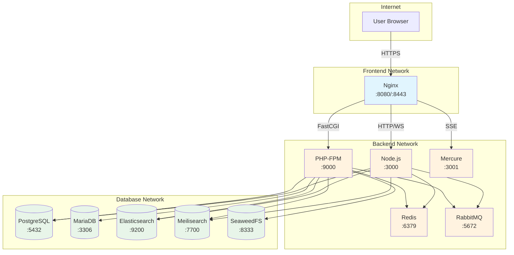
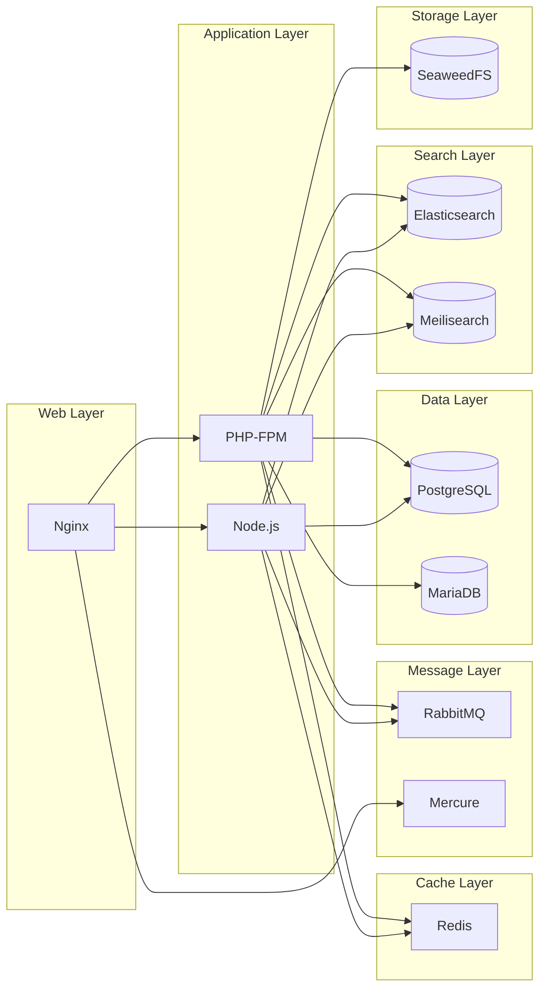
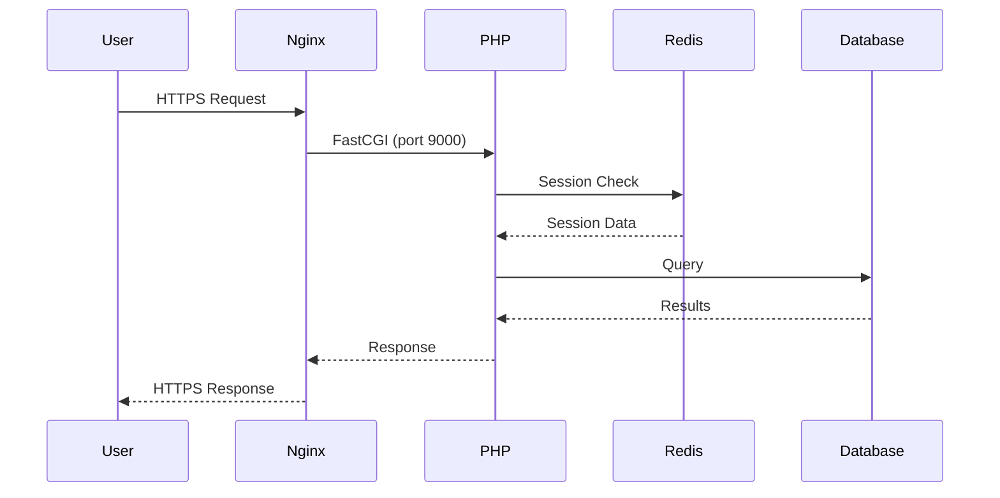
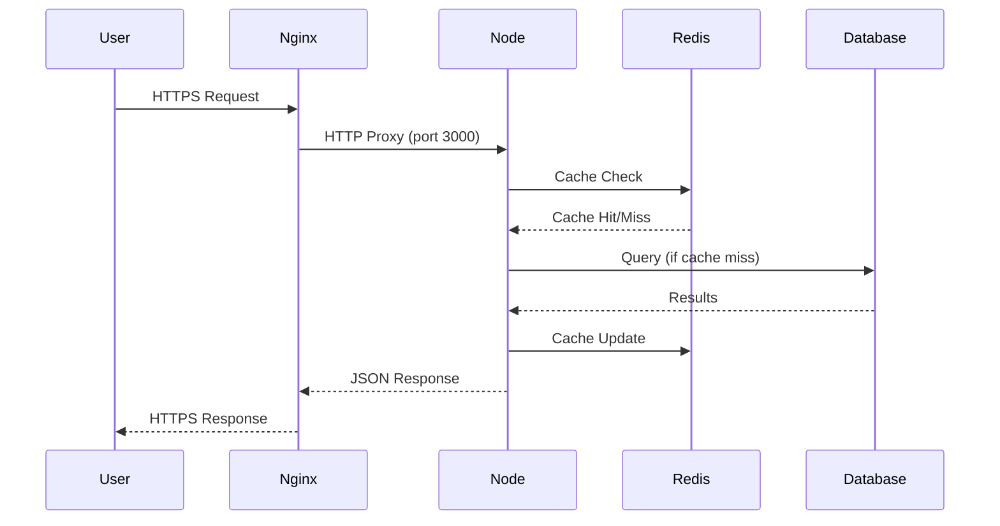
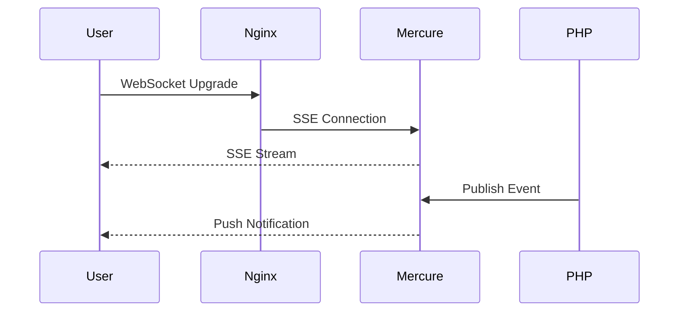
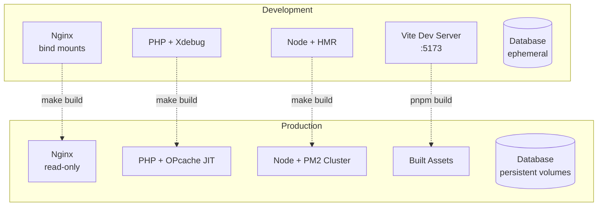
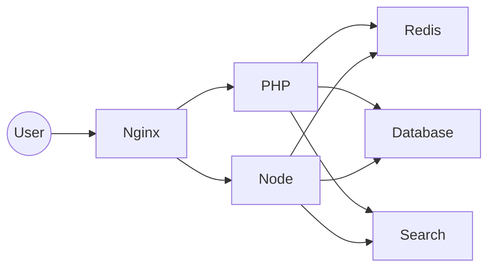

# Task 01: Add Architecture Diagrams

## Priority

MEDIUM - Post-Release v1.1

## Estimated Effort

2-3 hours

## Context

During the Documentation & Developer Experience review, it was identified that
while text descriptions of the architecture are excellent, visual diagrams
would significantly improve understanding, especially for:

- Network topology (three-tier network segmentation)
- Service interactions (which services talk to which)
- Request flow (how HTTP requests traverse the stack)
- Data flow (how data moves through the system)

Mermaid diagrams are ideal because:

- Render natively in GitHub/GitLab
- Version-controlled as text
- Easy to maintain
- No external tools required to view

## Current State

- `.zappzarapp/docs/infrastructure/ARCHITECTURE.md` exists with text descriptions
- `.zappzarapp/docs/infrastructure/NETWORK.md` describes network topology in text
- No visual diagrams exist

## Target State

Add Mermaid diagrams to documentation:

1. Network topology diagram
2. Service interaction diagram
3. Request flow diagram
4. Development vs Production comparison

## Implementation Steps

### Step 1: Add Network Topology Diagram

Edit `.zappzarapp/docs/infrastructure/NETWORK.md` and add:

```markdown
## Network Topology Diagram


```

### Step 2: Add Service Architecture Diagram

Edit `.zappzarapp/docs/infrastructure/ARCHITECTURE.md` and add:

```markdown
## Service Architecture


```

### Step 3: Add Request Flow Diagram

Add to ARCHITECTURE.md:

```markdown
## Request Flow

### PHP Request



### Node.js Request



### WebSocket/SSE Flow


```

### Step 4: Add Development vs Production Diagram

```markdown
## Environment Comparison


```

### Step 5: Add to README

Add a visual overview to the main `README.md`:

```markdown
## Architecture Overview



See [Architecture Documentation](.zappzarapp/docs/infrastructure/ARCHITECTURE.md)
for detailed diagrams.
```

## Verification

1. **Diagrams render in GitHub:**
   - Push changes to a branch
   - View the markdown files in GitHub web interface
   - Verify Mermaid diagrams render correctly

2. **Local preview (optional):**

   ```bash
   # Install mermaid-cli for local preview
   pnpm add -g @mermaid-js/mermaid-cli
   mmdc -i docs/ARCHITECTURE.md -o architecture.png
   ```

3. **Documentation links work:**

   ```bash
   grep -l "mermaid" .zappzarapp/docs/infrastructure/*.md
   # Should return files with diagrams
   ```

## Files to Modify

1. `.zappzarapp/docs/infrastructure/ARCHITECTURE.md` - Service architecture,
   request flow
2. `.zappzarapp/docs/infrastructure/NETWORK.md` - Network topology
3. `README.md` - Add visual overview

## Notes

- Mermaid syntax: https://mermaid.js.org/
- GitHub supports Mermaid in markdown since 2022
- Keep diagrams simple and focused on one concept each
- Use consistent colors/styles across diagrams
- Test rendering in GitHub before merging
